# Histogram Computation with OpenMP (SENG 442 HW2)

This project implements **parallel histogram computation** using OpenMP and evaluates different scheduling strategies (static, dynamic, guided).  
It was developed for the course **SENG 442 – Parallel and Distributed Computing**.

---

## 1. Introduction

The histogram computation problem counts the frequency of values in a dataset and groups them into bins.  
When applied to large datasets, this becomes computationally intensive and benefits from parallelization.  

Here, **OpenMP** is used to parallelize histogram computation, and performance is analyzed using metrics such as **execution time, speedup, efficiency, and scalability**.

---

## 2. Solution Explanation

- Each OpenMP thread processes a portion of the dataset.  
- To avoid race conditions, every thread maintains a **private histogram**, later merged into the global histogram via a `#pragma omp critical` section.  
- Scheduling strategies:  
  - **Static**: fixed division, low overhead, poor load balance.  
  - **Dynamic**: threads grab chunks dynamically, better balance, more overhead.  
  - **Guided**: decreasing chunk size, aims to balance overhead vs load.  

---

## 3. Code Implementation

Build with:
```bash
gcc -O3 -fopenmp histogram.c -o histogram
Run with:

./histogram <data_size> <num_threads> <schedule_type>
# Example:
./histogram 10000000 8 dynamic


Input parameters:

data_size = number of elements

num_threads = OpenMP thread count

schedule_type = static | dynamic | guided

Benchmark script (benchmark.py) automates runs and generates CSV + plots.

## 4. Analysis & Results
## Results

### Static Scheduling
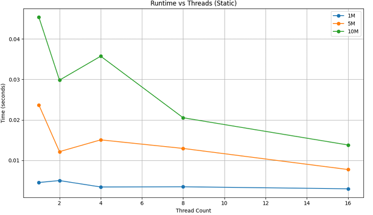
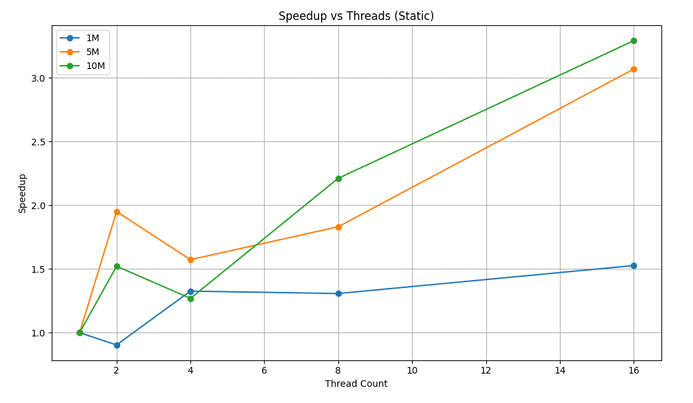
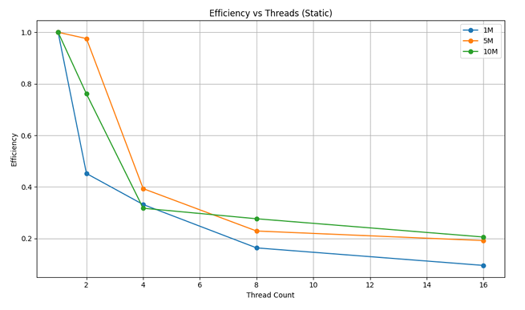

### Dynamic Scheduling
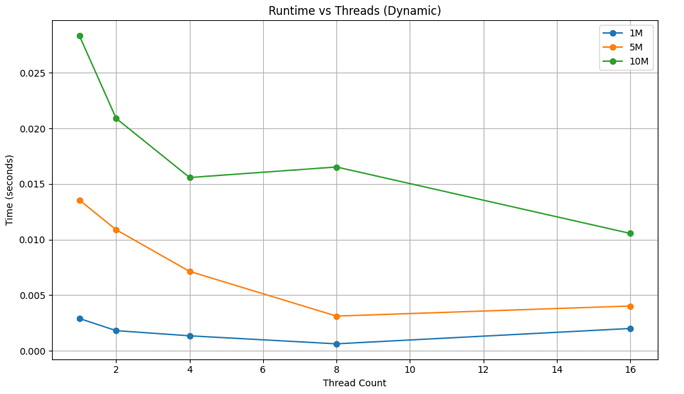
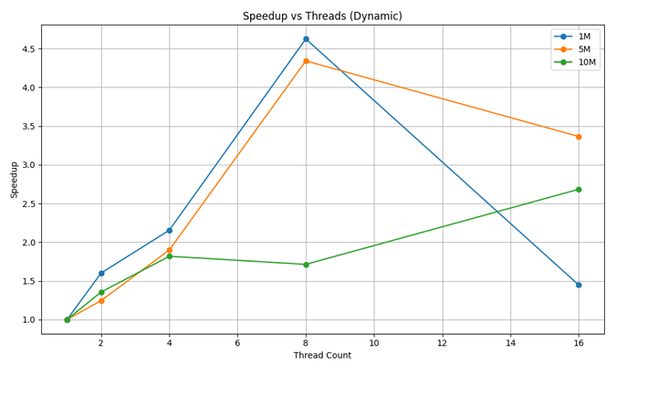
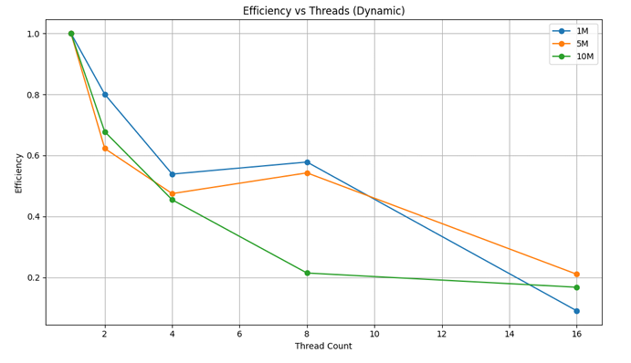

### Guided Scheduling
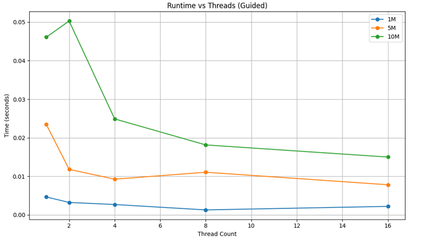
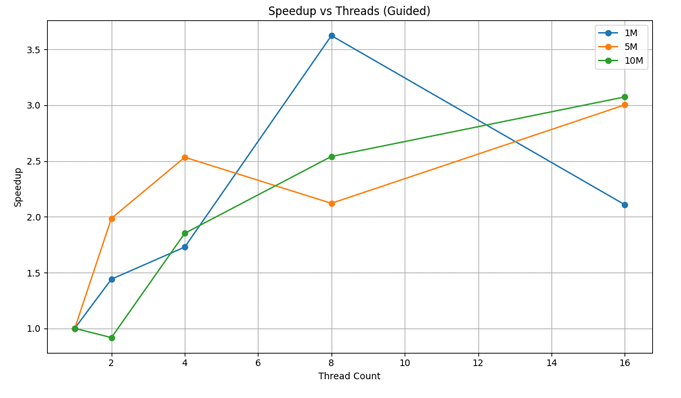
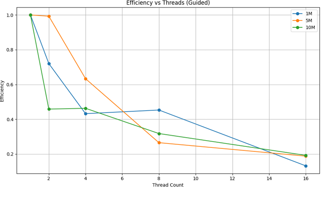

### Overall Comparison
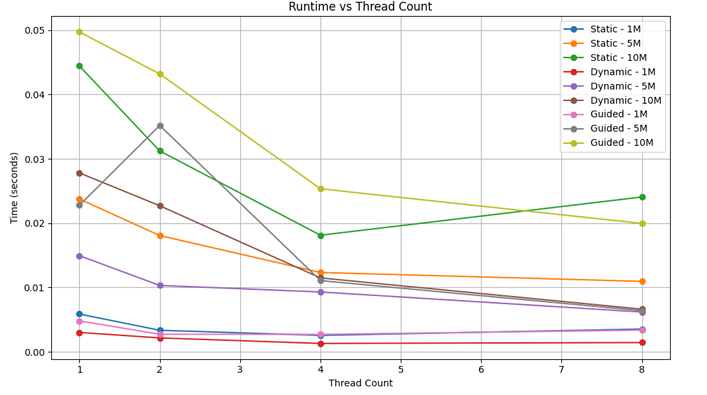
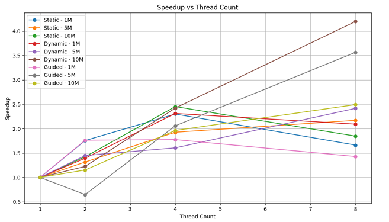
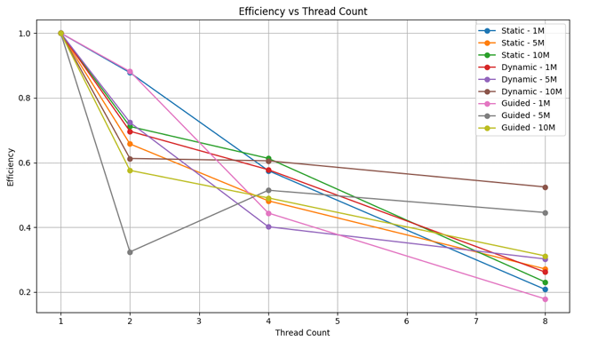

Execution Time

Static: good for small data, poor scaling at >4 threads.

Dynamic: most consistent; lowest times for large datasets (10M).

Guided: competitive at 2–4 threads, but inconsistent at higher threads.

Speedup

Dynamic achieved near-linear speedup at 8 threads for 10M data (≈4.6×).

Static scaled poorly beyond 4 threads.

Guided moderate at low threads, weaker at high threads.

Efficiency

Static dropped sharply (e.g., 0.10 at 16 threads for 1M).

Dynamic maintained better efficiency up to 4–8 threads.

Guided similar to dynamic, but slightly worse.

## 5. Conclusion

Dynamic scheduling offered the best balance of performance and scalability.

Guided added overhead, performing worse than expected.

Static worked only for small data / few threads; efficiency collapsed at higher threads.

Future improvements: using OpenMP reductions or lock-free merges to remove the critical-section bottleneck.

## 6. Files

histogram.c → OpenMP implementation

benchmark.py → Benchmarking + plots

plots/ → Generated runtime/speedup/efficiency figures

benchmark_results.csv → Collected results (auto-generated)
